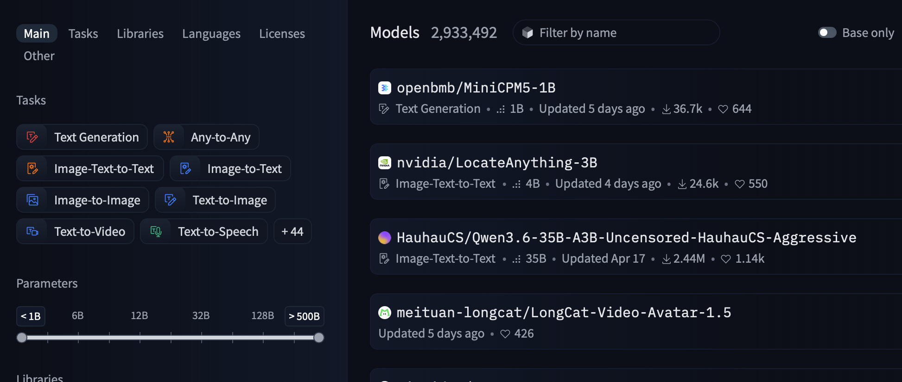
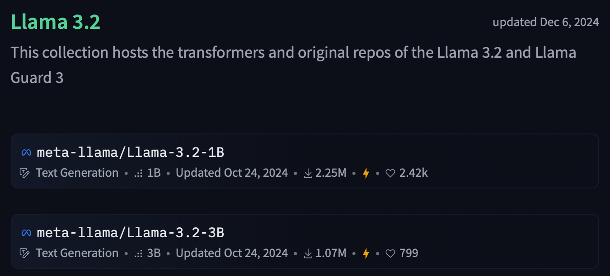
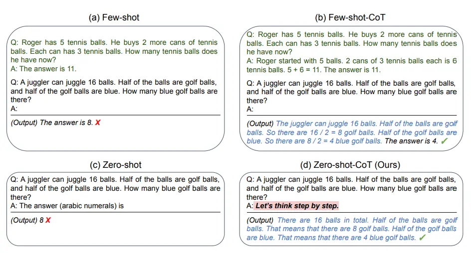

## Machine Learning

Machine Learning aims to enable machines to solve complex tasks, for example image recognition (What is in this image?) or natural language processing tasks like sentiment analysis (Is this movie review positive or negative?) without having to define ridgid rules to do so. To do that, statistic algorithms are used to extract information out of vasts amount of "training" data.

The classic machine learning pipeline consists of multiple steps. First, the model is trained on a set of training data containing examples of input and the desired output. In the example of image recognition that would be images as input and a label that describes what can be seen in the image as the desired output.
During training, the model then generates output for the input. The output is then analyzed to quantify how "wrong" the model was. This information is then used to tune the parameters inside of the model to make it less "wrong" in the future. Doing this for a large amount of different training examples should then ideally make the models generate outputs that are close to the ideal output.

After this training the model is then evaluated on a subset of the dataset it hasn't seen during training (see [datasets](../datasets)). If the training achieved the aimed goal of learning the underlying patterns that define the task, the model should generalize what it has "learned" and perform equally as good on this unseen data.

<a id="llms"></a>
## What are Large Language Models?

Modern general-purpose Large Language Models (LLMs) are transformer-based neural networks with (usually) billions of parameters, that are pre-trained on large text corpora. Through this pre-training, they learn statistical patterns in language and develop the ability to predict the next token (~word) given an input of words. 

### Why use LLMs?

Because LLMs are trained to "understand" language, their ability to generate new text given an input can be leveraged to fulfill a wide variety of natural language processing [tasks](../tasks). This makes them an easy to deploy, flexible "allround" solution for many different problems that can be formulated using natural language.

The ability of LLMs to handle this wide array of tasks also means that they can't be expected to be the "best" at every task. If your aim is to use the best performing model on a very specific task, for example sentiment analysis of product reviews, a specialized model only trained to do exactly that will most certainly be the better choice than general-purpose LLMs. 

## Open-Weights LLMs

"Weights" in LLMs are what define the neural network and with that the model itself. In a rough generalization, they "decide" how the model processes the input and how it generates the output, and they are the parameters that are tuned during training to optimize the model. 

Almost all of the commercial and generally known LLMs like OpenAI's ChatGPT, Anthropic's Claude or Google's Gemini are closed "blackbox" models, meaning that the public has no access to the weights and the inner workings of their models. To use their models, you input your request in their chat interfaces or send it to their API and they process it on their servers and only send you back the final generated output.

In contrast to these blackbox models, there are many different "Open-Weights" LLMs that make their whole model, including the weights, accessible to the public, meaning that you can download the models and deploy them on your own hardware. 


{ width="600"}
/// caption
Screenshot of the [huggingface model search](https://huggingface.co/models).
///


### Why use Open-Weights LLMs?

These Open-Weights LLMs offer multiple benefits in contrast to blackbox models, especially for businesses.

Because you can run them on your own hardware, you aren't subject to privacy concerns regarding for example customer data or business secrets. The requests to the models are all processed locally and never have to be sent to servers of a different company, usually in a different jurisdiction.

The access to the whole model, including the weights, also means that you are able to adjust the model to your specific needs, for example via [fine-tuning](../finetuning). Almost all Open-Weights LLMs are made available on the industry standard platform [huggingface](https://www.huggingface.co).


### Model sizes

Open-Weight models like [Meta's LLama modles](https://huggingface.co/meta-llama) or [Alibaba's Qwen models](https://huggingface.co/Qwen) are usually released in multiple different sizes. "Sizes" here refers to the number of parameters, usually between hundred millions and hundred billions, inside the model that were trained during its creation.

{ width="600"}
/// caption
Example of two different model sizes for the [LLama 3.2 Model](https://huggingface.co/collections/meta-llama/llama-32) as indicated by the "1B" and "3B".
///


### Why use smaller LLMs?

Allthough smaller models usually perform "worse" than their bigger counterparts, they still offer advantages. Their fewer amounts of parameters also mean that they require less available memory space and compute resources. While the biggest models usually require more than 100GB of space and need multiple parallel industry-grade GPUs to operate, smaller models only need few GBs of space and can run on consumer hardware. Smaller models often times perform "good enough" on specific tasks and can reduce resource requirements, including [energy consumption](../energy_consumption).

## Instruction Fine-tuning 

Because LLMs are trained to simply predict the next token given an input of tokens, making them useful chatbots and teaching them to follow instructions (e.g. "Give me a recipe for a fruit salad") requires further adjustments. These adjustments come in the form of "Instruction Fine-tuning". More on the details of fine-tuning [here](../finetuning). 

Open-Source LLM providers often times publish both the "base" version, trained to just predict the next token, and the instruction fine-tuned version of their LLMs. You can usually distinguish between the two by the "Instruct" behind the names of the instruction fine-tuned versions.

{ width="600" }
/// caption
Example of an [instruction fine-tuned model on the Huggingface-platform](https://huggingface.co/Qwen/Qwen2.5-7B-Instruct).
///

## Prompting

To get an LLM to fulfill a task, you need to specify that task in natural language. This instruction ("Give me the names of 3 european heads of state", "Summarize this text: ...") is called a "prompt".

### System Prompt

Along with the above mentioned "user prompt", there is also a "system prompt". This system prompt focusses more on the establishment of a baseline setting in which the user prompt is then processed, and is passed along with the user prompt to the model. For example: 

```
System prompt: "You are a helpful AI-Assistant focussed on recipe and cooking help."

User prompt: "Give me a recipe for a fruit salad."
```

### Prompting techniques and In-context Learning

Inside the user prompt you can apply different prompting techniques.

In-context learning describes the ability of an LLM to adapt to and execute a given task that is defined only in the prompt, and was never explicitly learned during the training phase. One approach to in-context learning is few-shot prompting, where you provide the model with a few examples (the "shots") of how the task should be solved and then prompt it to apply the pattern to the real input. For example:

```json
User: Translate the idiom into a literal description.
    Idiom: "Bite the bullet"
    Translation: To endure a painful or difficult situation that is unavoidable.
    Idiom: "Kick the bucket"
    Translation: To cease biological functions and die.
    Idiom: "Under the weather"
    Translation: Experiencing mild illness or physical discomfort.
    Idiom: "Spill the beans"    <-- This is the input you want proccessed
    Translation:
```

Not providing any examples for the task is called zero-shot prompting.

Another popular approach to prompting is Chain-of-thought (CoT) -prompting, which can be applied along side zero- and few-shot prompting. In CoT-prompting, you instruct the model to "think out loud" about the task while generating output.

{ width="800" }
/// caption
Overview of prompting techniques from [Kojima et al. (2022)](https://arxiv.org/abs/2205.11916).
///

CoT-prompting has been shown to increase the quality of the generated output, which lead to the adoption of CoT techniques in the creation of LLMs. Most modern state-of-the-art LLMs now first produce "thinking" output before the actual final output, with blackbox providers also hiding these thinking generations from the end user. 

