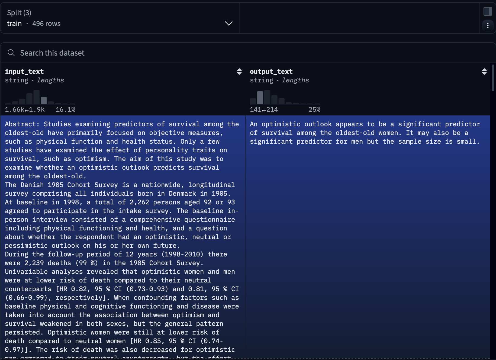
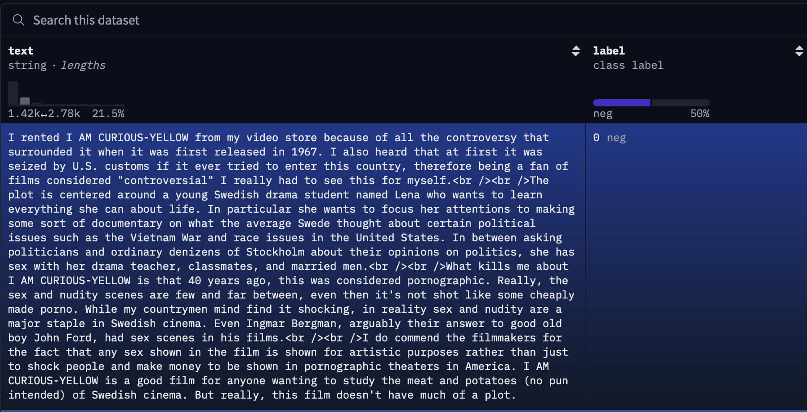

## Choosing a Dataset

If you have chosen the [task](../tasks) that fits your use-case, you then need to choose a dataset to use. You can either use an existing dataset or bring your own dataset to the platform.

### Existing datasets

There are a multitude of existing datasets publically available on the internet. On platforms like [huggingface](https://www.huggingface.co), you can browse available datasets and filter for example by type of data or type of task. In the most basic requirement, datasets need to provide an input and a "ideal" or correct output to this input (see [finetuning](../finetuning)). Most datasets provide extra information on top of just the input and output.

{ width="600"}
/// caption
Screenshot of the [LLM4KMU pubmedQA dataset](https://huggingface.co/datasets/llm-4-kmu/pubmed_gen_qa/viewer/) in the huggingface dataset viewer, showing and example of an input text and the desired output text.
///

### Your own dataset

You can also use your own, private dataset on the Auto-LLM platform. Your dataset needs to adhere to the input, output format described above. For that you will need to annotate the data.

#### Why annotate

To improve and train an LLM on a specific task and dataset, you need a "ground truth" to compare the LLM's output against. The comparison of the generated output with the ground truth, desired output for the given input then gets used to update the parameters of the model to increase the likelihood of generating the desired output the next time it sees a similar task. For more on the fine-tuning process see [fine-tuning](../finetuning)

#### How to annotate

The annotation logic depends on the task you want the LLM to fulfill. 

If you want it to classify input into different discrete categories, you need to label each input in your dataset with the correct category it belongs to. 

{ width="600"}
/// caption
Screenshot of the [stanfordnlp/imdb](https://huggingface.co/datasets/stanfordnlp/imdb/viewer/plain_text/train) dataset containing movie reviews and their sentiment (categories "0" = negative, "1" = positive).
///

If you want your model to perform open question answering, you need to annotate each input with an optimal answer to the text in the input (see pubmedQA screenshot above). Similarly for the Information Extraction task, you need to provide the desired extracted information next to the given input.

## Dataset Splits

For the fine-tuning on a specific dataset, the chosen dataset gets split into multiple different, random splits:

- Usually around 60-80% of the dataset gets used during the training. The model predicts an output, given the input in the data, for each items in this **train-split**. The generated outputs are then compared to the ideal outputs, and the internals of the model get adjusted to increase the likelihood of generating the desired output.
- Around 10-20% get withhold to test the settings during the training, this is the **validation-split**.
- The last around 10-20% get withhold to evaluate the final model after all training steps are complete. The model has never seen these items during the training, and so it's performance on this **test-split** is indicative of it's ability to generalise the learned behaviour to future tasks.

