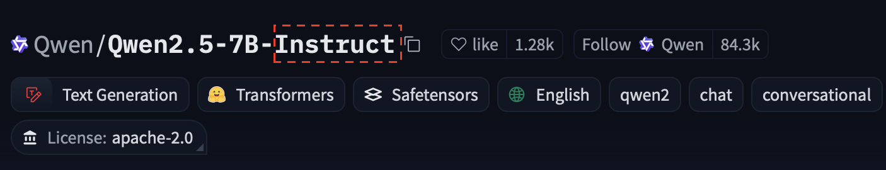

## What are Large Language Models?

Modern general-purpose Large Language Models (LLMs) are transformer-based neuronal networks with (usually) billions of parameters, that are pre-trained on large text corpora. Through this pre-training, they learn statistical patterns in language and develop the ability to predict the next token (~word) given an input of words. This ability can be leveraged to fulfill a wide variety of natural language processing [tasks](../tasks). 

## Open-Weights LLMs

## Instruction Fine-tuning 

Because LLMs are trained to simply predict the next token given an input of tokens, making them useful chatbots and teaching them to follow instructions (e.g. "Give me a recipe for a fruit salad") requires further adjustments. These adjustments come in the form of "Instruction Fine-tuning". More on the details of fine-tuning [here](../finetuning). 

Open-Source LLM providers often times publish both the "base" version, trained to just predict the next token, and the instruction fine-tuned version of their LLMs. You can usually distinguish between the two by the "Instruct" behind the names of the instruction fine-tuned versions.

{ width="600" }
/// caption
Example of an [instruction fine-tuned model on the Huggingface-platform](https://huggingface.co/Qwen/Qwen2.5-7B-Instruct).
///

